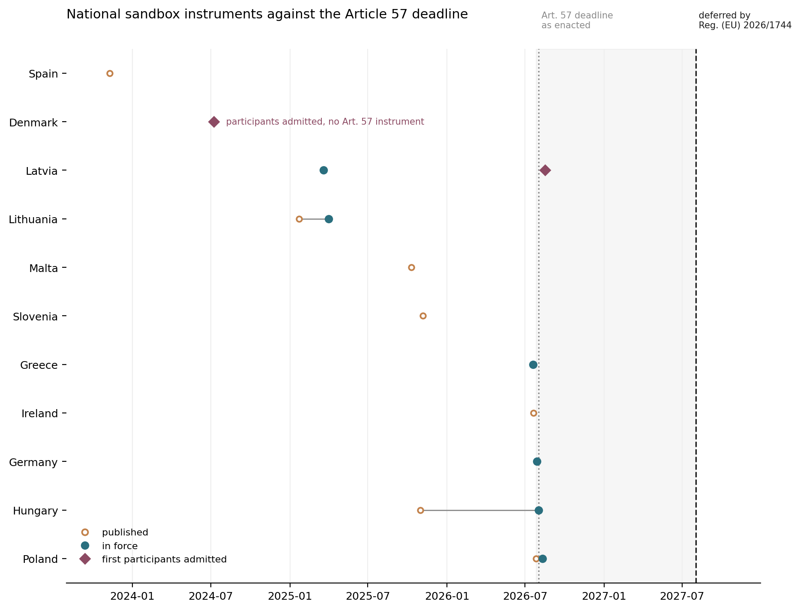

# EU AI Act Article 57 — national regulatory sandbox implementation

A coded dataset of how all 27 EU member states have implemented the AI Act's regulatory-sandbox mandate, built against primary sources and adversarially verified.

**Compiled 8 September 2026. Status as of that date.** This is a moving target — see [Known limits](#known-limits).

<!-- BEGIN:asof -->
**Rows last checked 2026-09-08.**
<!-- END:asof -->

---

## Why this exists

Articles 57–63 of the AI Act require every member state to establish at least one national AI regulatory sandbox. Published counts of how many exist vary, and most of them are wrong in the same direction.

The reason is definitional. A country can have a law, a designated authority, an announcement, a memorandum, and a sandbox-shaped programme admitting real participants — and still not have a sandbox constituted under Article 57. Counts that don't separate those things inflate.

This dataset applies one definition, uniformly, across all 27 states, and then tries to break its own conclusions.

## The headline findings

**Three states were initially coded as operational. After verification, one survives.**

<!-- BEGIN:verification-table -->
| State | Initial coding | After verification |
|---|---|---|
| Latvia | operational | **operational** — holds |
| Denmark | operational | **operational but not Art. 57** |
| Spain | operational | **precursor scheme (not Art. 57)** |
<!-- END:verification-table -->

Denmark runs a genuine, functioning AI regulatory sandbox with three rounds of participants — established administratively in March 2024 under the national digitalisation strategy, as a **GDPR/data-protection sandbox**. No Danish instrument creates an Article 57 sandbox: neither Lov nr. 467 (14 May 2025) nor the AI-loven (L 111, in force 2 August 2026) contains a sandbox provision. It carries no Art. 57(7) exit-report obligation and no Art. 57(9) legal certainty.

Spain's is a **pre-AI-Act precursor** under Real Decreto 817/2023 — 12 high-risk systems from 44 applications, two of them medical devices. Its own *vigencia* clause sunsets it at a maximum of 36 months from entry into force, or when the Regulation becomes applicable in Spain, whichever comes first. The Art. 57-native successor is still an unenacted bill.

**On a strict Article 57 reading, Latvia may be the only member state with an operational sandbox.**

<!-- BEGIN:health-finding -->
Health or medical AI is named in scope in **3 of 27** sandbox designs (Denmark, Latvia, Spain). The remaining 24 do not specify it.
<!-- END:health-finding -->

This is a claim about *design salience*, not legal exclusion — a sector-neutral sandbox can admit health AI without naming it, and Spain's did, twice. See [Known limits](#known-limits).

## Status distribution

<!-- BEGIN:status-table -->
| Status | Initial | Verified |
|---|---|---|
| operational | 3 | **1** |
| precursor scheme (not Art. 57) | — | **1** |
| operational but not Art. 57 | — | **1** |
| implementing | 14 | **14** |
| announced | 4 | **4** |
| nothing reported | 6 | **6** |
<!-- END:status-table -->

## Authority, and the conditions for using it

A sandbox mandate is not self-executing. Four things have to be true before a statutory sandbox can do the work the AI Act imagines for it: the authority must be able to **disapply a rule**, the sandbox must be **funded**, the exit report must **carry weight in conformity assessment**, and participation must be **recognised across the Union**. Each is coded here as a separate column.

<!-- BEGIN:conditions-table -->
|  | Power to disapply national rules | Dedicated funding | Exit report with conformity weight | Art. 58(2) cross-border recognition |
|---|---|---|---|---|
| yes | 1 | 1 | 1 | — |
| by cross-reference | — | — | — | 2 |
| partial | — | 2 | 2 | — |
| no | 4 | 1 | 4 | 2 |
| unknown | 7 | 14 | 10 | 13 |
| no instrument | 15 | 9 | 10 | 10 |
<!-- END:conditions-table -->

Read that table with its own caveat attached. `unknown` dominates because these conditions are rarely addressed in the instruments themselves and almost never published elsewhere — which is a finding about the public record, not a measurement of the sandboxes. What can be said positively is narrow and worth stating exactly: **one member state has demonstrably legislated the power to disapply a national rule, and one has an exit report that tracks Article 57(7).** Both are Latvia.



## What's here

```
data/article57-implementation.csv   27 rows, 30 columns
CODEBOOK.md                         dimension definitions and coding rules
CORRECTIONS.md                      every conclusion this dataset reversed, dated
CHANGELOG.md                        version history
scripts/validate.py                 schema and consistency checks
scripts/build_readme.py             regenerates the tables above from the CSV
scripts/make_figure.py              builds figures/instrument-timeline.png
scripts/build_anonymous.py          produces an anonymised build for blind review
figures/                            generated output
```

The CSV carries both `status_initial` and `status_verified`. The gap between those two columns is the point of the dataset.

Every table in this README is generated from the CSV by `scripts/build_readme.py`. Nothing here is hand-typed, so the prose cannot drift from the data.

## Method, in short

**Coding.** Each jurisdiction coded on nine dimensions (see [CODEBOOK](CODEBOOK.md)) against primary sources — the national instrument itself, the competent authority's own publications, official gazettes, EUR-Lex, and the European Commission's AI Act Service Desk. Searched in national languages where the instrument is untranslated, which is most of them.

**The decision rule that does the work:** *operational* means actually admitting or hosting participants. A legal framework with nobody in it is **implementing**, not operational. A designated authority is not a sandbox. An announcement is not an instrument.

**Adversarial verification.** Every claim that a sandbox was operational went through a second pass whose explicit brief was to **refute** it, defaulting to refuted where primary-source confirmation could not be found. That pass overturned one state's status and reclassified another.

**Source policy.** Tracker sites and aggregators were used for orientation only, never as a source of record. Many still carry pre-Digital-Omnibus dates: Regulation (EU) 2026/1744 moved the Art. 57 deadline from 2 August 2026 to 2 August 2027, and pages predating that are stale in a way that is not obvious from reading them.

Compilation used parallel AI research agents under the source rules above, with the verification pass and all primary-source checks run separately. This is disclosed rather than buried — a method that catches its own errors is more credible than one reporting none, and [CORRECTIONS.md](CORRECTIONS.md) is the record of what it caught.

**Validation.** `python3 scripts/validate.py` enforces the codebook mechanically: controlled vocabularies, ISO date formats and ordering, the operational decision rule, and the requirement that every coded judgement carries a written note and at least one source URL. It exits non-zero on any failure and should be run after every edit.

## Known limits

**The health-AI finding measures design salience, not exclusion.** "Not specified" is not "excluded." Twenty-four states do not *name* health AI; several of those sandboxes are sector-neutral and could admit it.

**Most states are pre-operational, which confounds that count.** With 14 implementing and 4 announced, many have not published scope documents at all, so the measure is partly of incompleteness rather than choice. Suggestively, the states furthest along are the ones that named health AI — suggestive, not demonstrative.

**n is small where it matters most.** One verified operational sandbox, one precursor, one refuted. Distributional inference from three cases is thin; the value here is the conflation finding and the individual case detail, not a distribution.

**The four condition columns are coded from instrument text, and mostly come back `unknown`.** They record what a national instrument provides for, not how a sandbox operates in practice, and several instruments could not be read in full. Treat `unknown` as "not established from the public record," never as "absent."

**Staffing and the timing of central guidance are not coded.** Both matter, and neither is reliably findable in the instruments; they are left out rather than estimated.

**Confidence values are self-reported.** Adversarial verification was run on the operational claims and on selected weak points, not on all 27 rows. Rows outside that set are desk research labelled as such.

**It ages.** Spain's scheme sunsets around November 2026. Several "implementing" states are mid-process. Treat the compilation date as load-bearing, and see `last_checked` per row.

**Do not cite a row without opening its source URL.** That applies to the compiler as much as to anyone else.

## Reuse

Corrections and challenges are welcome and are the point — open an issue. If you find a row that's wrong, that is a contribution to the dataset, not an attack on it.

Licensed **CC BY 4.0**. Cite as:

> Archibald, G. (2026). *EU AI Act Article 57 — national regulatory sandbox implementation across 27 member states.* Dataset, compiled 8 September 2026.

Compiled as the empirical component of *The Healthcare AI Trilemma*, with Dr. David M. Liu (UBC School of Biomedical Engineering).
